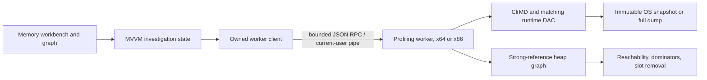

# Performance and memory profiling suite

The intended suite combines .NET Counters, CPU execution analysis, async/await investigations, database timings/running queries, File I/O, Windows events, and deep managed-memory analysis in a shared profiling workspace. The first update leads with memory investigations, following the selected implementation priority. It does not yet provide the other collectors.

## Product direction

Start from an investigation question, then connect evidence: **what grew**, **who owns it**, **why is it still rooted**, **what changes if this reference disappears**, and eventually **where was it allocated**. The graph and inspector should retain the same selection as users move between views. Use dotMemory's retention/dominator distinction and dotTrace's execution/timeline workflows as inspiration, while giving the user direct counterfactual cleanup results and clear evidence limitations.

The native WPF shell retains its graphite palette, Segoe UI typography, indigo investigation selection, amber roots, and green modeled release. The object relationship map is the central exploration surface. Quiet linked lists and an inspector provide search, exact values, and keyboard access; they do not compete with the map through decorative dashboard tiles. Focus mode supports the narrower space left by other docked tools.

## Implemented foundation

`WpfStudio.Contracts` defines serializable queries/results and session abstractions. `WpfStudio.Profiling` owns heap extraction and analysis without WPF dependencies. `WpfStudio.ProfilingHost` runs DAC work outside the IDE and serializes all access to one snapshot. `WpfStudio.Runtime` owns process/pipe lifetime and architecture routing. The WPF feature binds only bounded responses, cancels obsolete selection work, and checks capture/selection revisions before applying results.

A new capture starts a new worker; the previous successful one remains alive until replacement succeeds. Pinned comparison baselines retain aggregate type data rather than another full native snapshot. Cancellation closes only the new owned worker. Shutdown lets the worker dispose the DAC and OS snapshot before enforcing a bounded termination fallback. No worker terminates the user's target process.

The graph uses individual reference-slot identities and strong GC roots. Weak handles do not root objects. Dependent handles use key-to-value edges so values become reachable only when their keys do. Frozen objects receive permanent roots and stay alive in cleanup simulations. Immediate dominators use an iterative Lengauer–Tarjan implementation; all walks handle deep graphs without recursive stack growth. Removal estimates recompute reachability after skipping an exact removable edge/root or ordinary incoming references to an object, comparing only previously reachable objects.

See the [memory user guide](memory-profiler.md) for the implemented workflow, runtime support, bounds, and test coverage.

## Remaining release sequence

| Stage | Deliverable | Acceptance evidence |
| --- | --- | --- |
| 1 — Memory foundation | **Implemented:** dumps/live snapshots, comparison, root/field/delegate inspection, graph navigation, cleanup simulations, exports, isolated x86/x64 workers | Real fixtures, independent graph oracle, stale-result/cancellation tests, native WPF smoke test |
| 2 — Deeper leak investigations | Workload markers and repeated snapshots, rooted-growth candidate ranking, expected-lifetime annotations, saved investigations, richer arrays/structs, reference collections/filtered subgraphs, allocation-stack correlation | WPF fixtures with closed windows/view models, static events, dispatcher timers, caches, tasks/closures, weak references, and legitimate bounded caches; demonstrate both cleanup verification and false-positive restraint |
| 3 — Counters and GC timeline | Runtime gauges/rates, CPU/process memory, managed heap/LOH/POH, GC generations/pauses, allocation rate, thread pool, exceptions; custom provider selection | Correct units and intervals across supported runtime versions, bounded history, disconnect behavior, missing-provider and dropped-data reporting |
| 4 — CPU and async | Hot methods, inclusive/exclusive sampled execution, call trees/flame graphs, threads, source navigation; task/continuation/await timeline and causal links | Known CPU workload and async fixture; symbols/optimized code uncertainty; distinguish CPU samples, wall time, blocked time, and incomplete async correlation |
| 5 — Database, File I/O, events | Query spans and running operations, slow/failed/cancelled queries, file operations and latency/bytes, Windows Application/System/custom logs, correlation by process/time/activity | Provider-specific workloads, concurrent/reused connections, uncaptured query starts, restart/disconnect, parameter handling, PID reuse, event-log access failures and ETW loss |
| 6 — Advanced/native support | Native allocation accounting, mixed managed/native ownership, profiler-agent allocation/lifetime tracking, remote collection, large-heap persistence/indexing | Native leak and mixed-ownership fixtures, collector overhead measurements, large customer-like workloads, session compatibility and recovery |

Stages describe scope order rather than calendar promises. Finish and measure each collector end to end before presenting it as available in the app.

## Collector design

Use collectors behind explicit capabilities (`supported`, `unavailable`, `requires privileges`, `requires target instrumentation`) and a common session identity: process start time, runtime/build, architecture, capture clock, settings, and coverage/loss. Counters and spans share monotonic time and workload markers; persisted events also keep their original UTC timestamps. Process IDs alone cannot correlate sessions safely after process exit/reuse.

| Tool | Planned data source | Output and constraints |
| --- | --- | --- |
| .NET Counters | DiagnosticsClient / EventPipe with runtime EventCounters and modern `System.Diagnostics.Metrics` support | Gauges vs rates, units/intervals, version-aware schemas, bounded live charts and export. Framework uses a separate Windows performance-counter/ETW adapter rather than assuming EventPipe support. |
| CPU usage | EventPipe sample profiler plus runtime rundown and TraceEvent processing; Windows ETW adapter for Framework/native execution | Inclusive/exclusive sample weighting, call tree/flame graph, thread selection, symbol/PDB/source correlation. Instrumented method timings are a separate mode with measured overhead. |
| .NET async | TPL/task events and continuation/activity links, optionally an explicit diagnostic agent | Scheduled/running/completed tasks and causality. Suspension and wall-clock await time must not be labeled CPU time; lost events and missing identifiers leave explicit gaps. A heap alone can inspect captured task/state-machine fields but cannot reconstruct a complete execution timeline. |
| Database | DiagnosticSource / Activity events from supported drivers and EF Core; opt-in adapters for missing providers | Statement execution spans, duration, errors/cancellation, transaction/activity/connection identity. A live “running” span requires an observed start without an observed stop and a valid session; disconnect must not leave it falsely running. Server-side running-query views require a separately configured database connection and permissions, not guesses from heap objects. |
| File I/O | Windows kernel ETW File I/O for OS operations; optional application-level spans | Path, operation, bytes, start/end, thread/process, stack where captured. File system syscall timing differs from logical stream-operation timing. EventPipe alone does not capture kernel File I/O. |
| Event Viewer | Windows EventLogReader / EventLogWatcher for persisted/live event-log records | Provider/channel, ID, level, timestamp, payload. Preserve original XML. Attribute to a process only when evidence supports it; Windows event logs are different from the CLR/EventPipe trace stream. |
| Memory/allocations | Current ClrMD heap reader plus EventPipe/ETW allocation/GC data; optional CLR profiling agent for exact allocation/lifetime tracking | Root/dominator/cleanup analysis, allocation sites, generation/GC lifecycle, managed vs native accounting. Do not infer allocation stacks from a plain heap dump or track moving objects by raw addresses. |

[Microsoft's EventPipe overview](https://learn.microsoft.com/en-us/dotnet/core/diagnostics/eventpipe) establishes the boundary between runtime/managed events and native/kernel events; use separate Windows collectors where that boundary requires them. The [diagnostics client library](https://learn.microsoft.com/en-us/dotnet/core/diagnostics/diagnostics-client-library) supplies the supported session API. [dotnet-trace](https://learn.microsoft.com/en-us/dotnet/core/diagnostics/dotnet-trace) provides the reference collection/import workflow for managed traces.

## Memory features beyond the first update

1. **Guide the workload.** Record “before opening”, “after closing”, and repeated-cycle snapshots. Require growth after the expected lifetime boundary; distinguish warm-up caches from ongoing growth. An explicit target cooperation mode may collect after GC, with its effect displayed.
2. **Rank explainable candidates.** Prioritize growth in rooted counts/bytes and stable long-lived owners, then show the concrete root/field/delegate chain. Keep “observed retention” separate from “likely lifetime mismatch” and from user-confirmed leaks. Legitimate caches and finalizer delays are necessary negative examples.
3. **Make cleanup comparisons precise.** Extend one-slot removal to selected groups of slots, show remaining owners and affected subgraphs, and compare modeled cleanup against a later real capture. A retained-size number cannot predict native resource release or working-set changes.
4. **Expand inspection depth.** Add bounded inline-value/array inspection, collection-aware views, stack/handle descriptions, source correlation where symbols exist, grouping of repeated retention shapes, navigation bookmarks, and a dominator tree with retained object groups.
5. **Scale the map without drawing millions of nodes.** Keep full analytical indexes in the worker, virtualize graph rendering, expand individual boundaries on demand, collapse repeated types/collections, search by type/address/field, and preserve local layout when expanding. Show counts behind collapsed edges and separate display truncation from analytical incompleteness.
6. **Persist investigations.** Store compatible heap indexes or original-capture references, not just bounded JSON reports. Add crash recovery, comparison reloading, compatibility checks, and progress checkpoints. Measure extraction time, graph/index memory, query latency, and UI input latency on million-object heaps before claiming large-heap performance.

## Quality gates

- Every visible tool must have a functioning collection/import path and reproducible workload fixture.
- Cancellation, target exit, process identity changes, worker crash, missing symbols/DAC, unsupported architecture/provider, incomplete captures, and event loss must lead to accurate UI state.
- Heap semantics must pass independent reachability checks, including cycles, duplicate slots, shared roots, weak/dependent handles, pinning, finalization, and partial graphs.
- Async/database span lifetimes must not survive a disconnected session as if they were still running.
- WPF bindings remain clean; collection/analysis never run on the dispatcher; all worker/trace/OS snapshot resources are released.
- Record collector overhead and scalability measurements separately from correctness validation. An isolated worker protects the IDE boundary; it does not make profiling overhead free.
