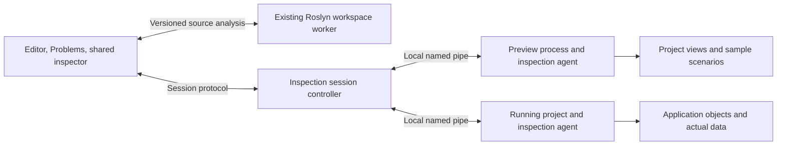

# XAML DevTools

Current milestone scope, 2026-09-28. Compiler-backed completion, diagnostics, hover, definitions and checked binding/name typo fixes are implemented in the existing workspace worker, with shared `ElementName` namescope resolution, authored-name references and reviewed rename, bounded project-wide XAML scans and explicit linked-file project selection. The isolated designer supports source preview, element picking, visual/logical trees, observed binding failures, property origins, temporary edits and reviewed source write-back. Explicit compiled preview activates built views and application resources without constructing the project's App. Opt-in .NET 8–10 running-application inspection provides live trees, binding issues, current validation/source facts, historical WPF failure evidence, picking and highlighting. Checked navigation from runtime object hints and reviewed local source edits are implemented for supported compiled/current XAML mappings. Shared temporary property editing is implemented for preview and live sessions; current verification results belong in [VALIDATION.md](../VALIDATION.md). The remaining capabilities below form the future roadmap and are not prerequisites for delivering this implemented milestone.

The product goal is to make building and troubleshooting WPF views feel as immediate as working in browser DevTools. Support both a designer with sample data and inspection of the actual running application. Binding diagnostics is the first milestone.

## The experience

Select something on screen and understand why it looks and behaves that way. Selection stays synchronized between the rendered view, the element tree, the XAML editor, and the inspector. The same inspector works against either a **Preview** session or a **Running app** session, with the target and data scenario always visible.

| Surface | Questions it answers |
| --- | --- |
| Elements | Which control is this? Where is its XAML? Which template created it? |
| Bindings | What object is the source? Where did the DataContext come from? Which path segment failed? What value reached the target? |
| Properties | What is the effective value? Did it come from a local value, binding, style, trigger, inheritance, or animation? |
| Layout | What size did the element request and receive? Which parent constraint, alignment, margin, or clipping explains the result? |
| Resources | Which resource declaration was selected? Which dictionary and scope supplied it? |
| Issues | What failed, where, how often, and is it still failing? |

Visual Studio already provides a [Live Visual Tree and Live Property Explorer](https://learn.microsoft.com/en-us/visualstudio/xaml-tools/inspect-xaml-properties-while-debugging?view=visualstudio), plus [XAML Binding Failures](https://learn.microsoft.com/en-us/visualstudio/xaml-tools/xaml-data-binding-diagnostics?view=visualstudio). The intended improvement is a connected authoring loop: detect a mistake, explain its cause, navigate to the exact expression, fix it, and observe the result from the same workspace.

For example, consider this expression on a view whose declared design context is `CustomerViewModel`:

```xml
<TextBlock Text="{Binding Customer.Nmae}" />
```

The editor should underline `Nmae` and explain: “`Customer` resolves to `CustomerDetails`; that type has no readable member `Nmae`. Did you mean `Name`? Checked against the declared design DataContext.” Offer a source edit only when the replacement is unambiguous.

Runtime evidence must be labeled separately. The cached path may establish that `Customer` resolved and the next step failed, but WPF can erase the failed owner's reference; this does not always distinguish a null `Customer` from a missing member. Show a null cause only when evidence supports it, and label earlier null-item notifications as historical. If the actual DataContext has another type, show that observed type. Design assumptions and runtime observations must remain distinguishable.

## What exists today

- `XamlNameScopeIndex` and `XamlNameService` share compiler-backed named-element resolution across `ElementName` completion, hover, definitions, declaration diagnostics and checked spelling fixes. Authored-name Find References and reviewed rename use exact declaration/scope identities, including independent template-local names. `XamlGeneratedNameBridge` verifies supported generated page fields before including authored C# uses, and `WorkspaceEngine.XamlNames` rechecks edited and untouched references. `XamlNameProjection` and `WorkspaceEngine.XamlNameProjection` now derive in-memory generated fields for accepted reviewed rename states, with worker/client lifecycle reconciliation. Binding-path inference uses the same namescope index. Custom/runtime-dependent scopes remain uncertain; arbitrary direct name/type edits and broader name consumers remain outstanding. For verified coverage, see [named elements](xaml-named-elements.md) and [completed validation](../VALIDATION.md).

- `src/WpfStudio.Core/Wpf/WpfIndex.cs` indexes source and diagnoses malformed XML and resource problems. It does not instantiate views or validate binding members.
- `src/WpfStudio.Workspace/Xaml` shares Roslyn resolution across binding completion, diagnostics, hover, source navigation and checked typo corrections. It supports declared/scoped contexts, typed and inferable inline templates, ElementName namescopes, supported RelativeSource forms, local static sources, and common indexer/collection paths. `XamlSchemaService` resolves control types, inherited properties/events, attached properties, namespace mappings and enum/bool completions from compilation metadata. Uncertain cases remain unresolved.
- `src/WpfStudio.App/Services/XamlCompletionService.cs` retains local framework/control/resource suggestions; the former source-text binding inference has been removed.
- `src/WpfStudio.App/ViewModels/EditorViewModel.cs` debounces XAML and C# diagnostics, rejects stale results, and refreshes XAML after semantic workspace changes. Its project selector chooses the owning compilation for linked XAML; context revisions invalidate completion, hover, navigation and quick fixes, including changes away and back. The editor provides typed hover, F12 definitions and explicit Ctrl+. spelling fixes with existing workspace undo. Problems and WPF Issues show live findings.
- `WorkspaceEngine.XamlProject` analyzes evaluated XAML per owning project, including closed files, using immutable compilation snapshots and explicit open-buffer overlays. Closed C# refresh updates the workspace without creating replay buffers or overwriting unsaved models; unavailable model inputs withhold affected project/dependent contexts. `ShellViewModel.XamlDiagnostics`, `ProjectXamlAnalysisScheduler` and `KnownSourceFileWatcher` coalesce changes, reject obsolete batches, label project-specific results and preserve build diagnostics. Source hashes and context checks guard diagnostic navigation.
- `src/WpfStudio.Workspace/WorkspaceEngine.cs` owns Roslyn projects, unsaved C# buffers, and generated documents in an isolated worker. This is the appropriate semantic authority for project types and generated Toolkit members.
- `src/WpfStudio.Contracts/WorkspaceContracts.cs` and `src/WpfStudio.Core/Documents/WorkspaceEdits.cs` supply source locations, document versions, checked edits, and undo.
- `src/WpfStudio.Runtime/Debugging/DebugSession.cs` supplies managed debugging through DAP/netcoredbg. The separate `Runtime/Inspection/InspectionSession` authenticates and manages running-application inspection and explicit temporary edits without owning the target process.
- `src/WpfStudio.PreviewHost` loads source XAML on a separate WPF dispatcher, renders PNG snapshots, maps authored dependency objects to exact source tags (including repeated template instances), and inspects tree nodes and dependency-property values. These observations describe preview state; the separate live agent observes the actual application.
- `src/WpfStudio.Runtime/Design/PreviewClient.cs` owns current-user named-pipe sessions, deadlines, cancellation, restart, rebuilt-assembly detection and process cleanup. `Features/Designer` presents the preview and inspector. Source changes immediately invalidate old node IDs and inspector state.
- `src/WpfStudio.Core/Wpf/XamlPropertyEditService.cs` creates precise source edits from a checked document version/hash, exact authored start tag and canonical property identity. Preview supplies its rendered source map; live inspection supplies the separately verified compiled/build/current-source chain. Value validation does not set the live property, but can invoke the application's dependency-property validation rule. Both paths use the existing diff/transaction/undo flow. Binding/resource/object replacements and authored template scope are explicit in the diff; style-derived values create local overrides while shared style declarations remain unchanged. Explicit XAML null, empty text and local removal are separate actions.
- `src/WpfStudio.PreviewHost/CompiledPreview.cs` activates a selected built view with a public parameterless constructor or explicit scenario view factory, loads compiled `Application.Resources` without constructing the project App, and reports assembly hash/module provenance. `PreviewScenarioActivation` resolves and invokes explicit project factories inside the host; `PreviewScenarioCatalog` reads the project-local JSON catalog without loading project code into the IDE. Compiled mode has no unchecked current-buffer source map; compiled and named-scenario refreshes start fresh processes. Source previews support bounded design-time literals and property elements. Broader compiled fidelity and declarative sample construction remain separate work.
- `WpfStudio.Inspection.StartupHook`, `.Agent` and `.Protocol` support opt-in .NET 8–10 WPF launch inspection. `Features/Inspection` presents actual application objects, dependency properties, binding source types/status and early trace history. Snapshot traversal spans presentation sources on their own dispatchers and keeps weak identities; disconnect leaves the target running. Preview and live inspection share `WpfStudio.Wpf.Diagnostics.BindingReader`, the guarded cached-path adapter and historical `BindingEvidenceCollector`, plus the `Features/BindingDiagnostics` explanation panel. Details attach to exact root/child expression identities; draft and stale-selection guards remain in their parent view models. See [binding explanations and limits](xaml-binding-diagnostics.md).
- `Runtime/Inspection/InspectionSourceResolver` and `InspectionSourceSymbols` verify loaded module metadata, portable/embedded PDB identity and compiled `InitializeComponent` resource-to-document mappings. `Core/Wpf/XamlBuildSourceLease` holds workspace XAML input bytes stable through the inspected rebuild, and `XamlRuntimeSourceLocator` checks exact object positions against the matching editor text. The shell's **Show XAML** command preserves selection/session/workspace guards through these checks; a source hint alone never authorizes a jump or edit.
- `Inspection.Agent/SourcePropertyMetadata` and `RunningInspector.SourceEditing` validate an observed property independently of temporary-edit support and return eligible authored types with module/namespace/content-property metadata. `Features/Inspection/InspectionSourcePropertyMapping` matches the exact XAML type, including a base-type root with `x:Class`. The shell reviews a local source proposal, then repeats runtime/source checks before applying it with a final synchronous transaction guard. It does not infer a shared style or resource declaration as the edit target.
- `WpfStudio.Wpf.PropertyEditing` targets `net8.0-windows` and supplies scalar conversion and owned temporary overrides to the preview host and live agent. An opaque runtime property ID selects the actual observed dependency property; observed-state tokens reject stale changes. Overrides use an owned constant OneWay binding, then restore the original local value or binding, or clear the override to restore style/inheritance precedence. Ownership conflicts preserve application replacements. Runtime operations have bounded receipts and distinguish rejected, applied, reset, conflict and unknown outcomes.
- `tests/WpfStudio.App.Tests/ShellSmokeTests.cs` captures WPF binding traces for the IDE's own UI and exercises the preview through a real process. Preview and host/client tests cover malformed markup, templates, binding failures, temporary edits/reset, crashes, hung constructors and cleanup.

### Appearance inspection

The shared Appearance panel observes selected dependency-property state in preview and live sessions. It shows current WPF source/flags, applied Style/BasedOn and relevant trigger declarations, bounded available dictionary keys, local DynamicResource keys and historical StaticResourceResolved notifications. Reads validate session/render/tree/property identity and run on the owning dispatcher. The collector uses bounded weak associations and begins before XAML loads; dictionary and setter values are not evaluated. Source hints remain unverified. Complete resource lookup reconstruction, active trigger attribution and verified style/resource source navigation remain acceptance work. See [usage and limits](xaml-appearance.md); measured results belong in VALIDATION.md.

## Milestone 1: explain broken bindings

Deliver this in two increments, using one diagnostic model and one inspector. The first increment is valuable before a renderer exists; the complete milestone adds actual runtime evidence.

### Language-engine boundary

Keep the XAML semantic engine as a focused service in `WpfStudio.Workspace/Xaml` for now. It takes source text and a Roslyn compilation and returns editor-independent records; the workspace worker owns project selection and RPC. The shell owns presentation and buffer lifecycle. This allows extraction into a separate library and an LSP adapter later without making protocol/deployment work a prerequisite for autocomplete and live diagnostics. No separate server, repository, or package is needed for the first release.

The implemented engine validates XML, resolvable XAML types/members and supported binding paths while completing unfinished edits. It returns precise spans and explicit spelling fixes. Qualified binding segments such as `(Grid.Row)` and `(local:Provider.Value).Name` use the binding's lexical namespace scope and the declared source type. Owner/member completion, hover and source definitions retain separate raw source spans, including XML entities. Readable attached-property metadata supplies the continuation type without loading or executing the project assembly.

Runtime dependency-property registration can differ from CLR wrappers, so unavailable or ambiguous metadata does not prove a qualified member is missing. The engine follows [WPF's property-path lookup structure](https://github.com/dotnet/wpf/blob/main/src/Microsoft.DotNet.Wpf/src/PresentationFramework/System/Windows/PropertyPath.cs) conservatively: known continuations can produce spelling diagnostics, while unsupported segments stop source inference. Qualified tokens remain outside generic CLR property rename and reference matching, with explicit incomplete-coverage warnings. Parameterized paths such as `(0)`, typed/multiple indexers, Storyboard target paths, runtime-provided resources, arbitrary markup-extension semantics, dynamic contexts and ambiguous sources still require more work; they must not fall back to guesses about the surrounding DataContext.

The engine now shares [project-aware resource resolution](xaml-resource-resolution-plan.md) across binding diagnostics, completion, hover, definitions, spelling fixes, references and rename. Evaluated dictionary identities preserve declaring namespaces and assemblies; unsaved XAML overlays and content fingerprints refresh dependent consumers. Direct keys and reverse merge precedence are supported, while unavailable higher-priority scopes block guessed fallback. Spelling fixes guard consulted dictionaries, and rename rebinds consumers against the complete proposed texts. This establishes declared source types, not runtime resource identity.

Ordinary editor requests keep the evaluated resource catalog separate from captured dictionary text and follow the current document/application import closure. The catalog retains unloaded duplicate URI candidates; reading fewer files cannot make an ambiguous identity appear unique. Shared schema metadata is weakly cached by the exact immutable compilation, with cancellation and mutable request state kept local. [Worker performance measurements](xaml-language-performance.md) record the bounded 20/200/600-file synthetic workload; they do not establish end-to-end typing latency or arbitrary solution scale.

### Project scans and linked editor contexts

Project analysis uses the evaluated XAML inventory of each loaded compilation. Problems and WPF Explorer Issues include closed-file diagnostics, with **Check XAML** and **Check project XAML** actions for an immediate refresh. A linked physical file is analyzed separately for each owning project and its results carry project names/paths. The editor's **Project** selector determines the context for its own completion, diagnostics, hover, definitions and quick fixes. An ambiguous project or target-framework context remains unavailable; list order never selects a compilation implicitly. Opening a project diagnostic chooses its owning editor context only when that context is unambiguous.

Each scan snapshots the open buffers, synchronizes unsaved C# into Roslyn, refreshes known closed C# sources, then analyzes XAML with unsaved overlays taking precedence over disk. Closed XAML is read again even when its size and timestamp did not change; decoded text hashes identify the analyzed source. Overlays are request snapshots, not fake synchronized editor documents. Restart replays actual unsaved C# buffers, while subsequent scans supply the current XAML overlays. Missing, unreadable or oversized model files make affected projects and their dependents unavailable, including on-demand editor analysis. A bounded model sweep continues on a later refresh rather than treating unread files as current.

Source changes schedule a debounced scan, with only one batch active. Watchers include known linked files outside the workspace and selected ancestor build configuration files. A 15-second reconciliation refreshes the known inventory when no scan is active, supplementing notifications without trusting timestamps. Detected project/solution changes, source membership changes, directory changes or watcher overflow require workspace reload and invalidate semantic XAML assistance until it is re-evaluated. Routine atomic replacement of an existing file is treated as a content change when its membership remains known. Periodic refresh does not re-evaluate MSBuild items, reconstruct arbitrary import graphs or guarantee discovery of new files after lost notifications; reload remains necessary for those cases. Watcher coverage is bounded and reports when some directories could not be watched.

Batch results distinguish analyzed, missing, unavailable and oversized files, and display incomplete coverage. Request generations, immutable semantic snapshots, editor versions and source epochs reject obsolete results. Pending external model changes suppress stale editor findings. Problems and WPF Issues merge current editor/project/index results while retaining build diagnostics. Diagnostic navigation rechecks the analyzed text hash/version and current workspace before using an offset; it rejects stale locations instead of guessing a nearby declaration. Applying a quick fix also rechecks its editor, document and project context after awaited work.

| Budget | Limit |
| --- | --- |
| XAML batch | 512 file/project contexts; 1,000,000 characters per file; 8,000,000 total text characters; 2,000 returned diagnostics |
| Open XAML overlay request | 2,048 overlays; 16,000,000 total characters for owned files |
| Closed C# refresh | 2,048 files per pass; 2,000,000 characters per file; 16,000,000 total text characters |
| Diagnostic cache | 128 entries and 8,192 retained diagnostics; messages limited to 2,048 characters plus an omission marker |

These bounds describe the implemented scan, not complete coverage of an arbitrarily large solution. The status reports partial or unavailable coverage, and broader workload/latency measurements remain acceptance work.

### Event-handler language assistance

The event service uses the current C# compilation and the root `x:Class` to resolve event values. Compatible-method completion, hover, source definitions and diagnostics use a transient Roslyn probe of the delegate construction emitted by WPF: `new EventDelegate(this.Handler)`. This preserves compiler overload resolution, accessibility and parameter/return compatibility instead of approximating them with signature equality. The [WPF markup compiler](https://github.com/dotnet/wpf/blob/main/src/Microsoft.DotNet.Wpf/src/PresentationBuildTasks/MS/Internal/MarkupCompiler/MarkupCompiler.cs) constructs that instance delegate for CLR events and attached event helpers. The service supports ordinary events, owner-qualified routed events, registered attached-event helpers, and `EventSetter.Handler` with a resolved event/Style target type. No project assembly is executed.

Create-handler quick fixes carry a version/hash prerequisite for the XAML buffer and a checked insertion into authored C#. A named missing handler leaves XAML unchanged; an empty value receives a unique conventional name. Current authored XAML names are reserved even before their generated fields enter the compilation; nested namescopes are conservatively reserved too. The generated method follows the actual delegate signature and is rebound before it is offered. Existing text, line endings and unrelated members remain intact. Unsupported or ambiguous destinations yield no fabricated target. Generated files are not edited.

The Shell validates every source snapshot before mutation and checks editor identity, semantic/project context, selection, target identity/version and read-only state again at application time. Both files share a workspace transaction and undo entry; unchanged prerequisite files are checked but do not become edits or undo dependencies. Applying activates the generated C# member and synchronizes it immediately for subsequent navigation. It does not save, build or execute the application.

Probe and authored-event budgets are separate from diagnostic output limits, so many valid handlers cannot make checking unbounded. Incomplete or unsupported coverage is reported. `x:Subclass`, inline `x:Code`, non-C# roots and other unresolved contexts still need broader language support; they are not diagnosed as missing ordinary handlers.

### Cross-language references and rename

Reference search combines Roslyn references with compiler-resolved XAML property-path segments and event-handler values. It scans evaluated project XAML, reads closed files and prioritizes current open overlays. Symbols are matched through authored definitions and assembly/declaration identity rather than spelling. Inherited members, interface/override families, referenced projects and selected handler overloads remain distinct. Raw source spans retain XML entity encoding for navigation and replacement. Indexer literals and arbitrary text are not treated as member names.

Authored-name Find References additionally returns the selected `x:Name` or supported runtime-name declaration and its verified inline/object `ElementName` uses. Page and template declarations retain separate identities even when their names match. Template-local rename changes only that declaration's supported references and does not invent a page field. References can report proven matches with explicit incomplete-coverage warnings; rename requires complete supported name consumers in every affected linked context.

For supported compiled page names, commands can start from XAML or from an authored C# use of the actual generated field. The initial bridge verifies the WPF-generated document, instance field, root `x:Class`, element type, mapped declaration line and compiler checksum against the exact XAML bytes and current buffer. A spelling or matching type alone does not establish the bridge. Generated declarations are first renamed in a temporary Roslyn solution for compiler/conflict validation; the reviewed edit contains authored XAML and C# changes, never generated-file writes. Proposed name changes rebind every old name occurrence, including untouched references, and preserve the already-resolved binding/event symbols in the edited XAML.

Rename uses [Roslyn's solution rename](https://learn.microsoft.com/en-us/dotnet/api/microsoft.codeanalysis.rename.renamer.renamesymbolasync) for C# and adds the verified XAML replacements. Every affected linked context must agree on the symbol. The engine checks for new compiler errors and re-resolves every previously resolved occurrence, including untouched bindings and files, to catch property hiding or overload capture. Static design types are authoring assumptions, not proof of the runtime DataContext; those assumptions and unresolved/dynamic paths appear in coverage notes. Missing files, unavailable model contexts, malformed XML and hard scan limits prevent a partially scanned rename from being offered.

The editor shows only actual mutations in the diff, but every scanned XAML file remains a hashed prerequisite so a changed closed file cannot introduce an unseen reference during review. Final application checks workspace/configuration, semantic and source revisions, editor/caret/selection context, buffer identities/versions, external file changes and target writability. Cancel releases temporary clean snapshots of closed files; they do not become hidden overlays for later searches. Apply preserves existing unsaved work and creates one workspace undo entry. Reference results carry text hashes and owning project context, and navigation rejects superseded source.

Symbol commands settle open-buffer synchronization and closed-source refresh before capturing their semantic context. If the worker discovers another disk change during its own snapshot capture, it notifies the client independently of query success, including rejected renames. Other XAML editors then invalidate their diagnostics and actions; an in-flight operation using the old semantic context is discarded.

Applying a reviewed page-name rename now atomically commits synchronized authored snapshots and derived generated fields inside the worker's Roslyn solution. The plan carries original XAML bytes, exact generated-file hashes and checked rename steps, not caller-supplied generated code. The original compiler checksum remains the provenance anchor; it is never rewritten to authenticate projected text. All linked owners must be covered, generated documents have one projection owner, and generated disk output remains unchanged. Repeat rename can start from either language or target another verified field on the page. Projected F12 rechecks current namescope/declaration metadata and exact generated field identity, including after unsaved C# changes.

Workspace undo reconciles final authored buffers against known states. Closing or discarding XAML selects a recognized saved state; C# discard remains independent and can correctly reveal a mismatch with the current XAML. Worker restart reconstructs retained plans against unchanged generated baselines and current buffers or saved/closed known XAML states. Loading a saved WPF project can also regenerate output: adoption requires the ordinary checksum-backed bridge to verify every current page field in every owning project against matching saved/current XAML, then retires the old projection history. Other changed generated baselines reject replay. Explicit load/reload and context changes clear retained plans. The worker commits against its captured solution/revision, preserving newer authored updates and ordinary closed-file C# refreshes.

This is bounded projection of reviewed name renames, not general design-time XAML compilation. An unsaved XAML buffer outside the exact recorded states restores the original compiler baseline with an explicit unavailable status; arbitrary name/type edits, insertion/removal and unrelated XAML modifications require save, build and reload to establish a new baseline. Current limits are 32 steps and 32 generated documents per model, 32 projected pages per workspace, 32,000,000 retained characters per model and 64,000,000 workspace-wide. Broader direct-edit projection and its semantic freshness remain future work. The projection-specific tests and packaged-worker checks are recorded in [VALIDATION.md](../VALIDATION.md).

`TargetName`/`SourceName`, `x:Reference`, runtime-name property elements and qualified runtime-name attributes, qualified or unsupported nested/conflicting `Binding.ElementName` forms, inline `x:Code`, and uncertain custom scopes are outside this name-refactoring slice. Their detected presence makes coverage incomplete and withholds rename. Runtime `RegisterName`/`FindName`, reflection and other string-based consumers remain unverified and are never rewritten by spelling.

The scan currently bounds 512 file/project contexts, 1,000,000 characters per XAML file, 8,000,000 total characters and 16,384 collected occurrences/results. Per-file extraction separately limits XML depth/elements, binding paths, walked segments, event probes, name-consumer work and occurrences. Broad XAML type/generator refactoring, additional namescope forms, arbitrary markup extensions, reflection/string references and multi-target project selection need further support. Existing resource-key rename remains a separate declaration-resolved operation.

### Formatting and structural typing

The formatter operates on raw source spans and returns whitespace edits instead of serializing an XML tree. Attribute order, quote choice, entities and quoted markup extensions remain authored text. It normalizes tag spacing, wraps long/multiline attribute lists and indents structural content while retaining the source newline convention. Compiler metadata determines content-property and collection semantics; standalone XAML without project context can use a conservative set of known framework containers. When a known workspace or project's metadata is unavailable, local fallback disables those framework assumptions and preserves content spacing, including elements in the canonical WPF namespace. The worker withholds formatting for an unavailable or ambiguous owning context rather than applying standalone rules. Unknown or text-bearing boundaries retain their content whitespace. This distinction matters because WPF can [render whitespace between inline elements](https://learn.microsoft.com/en-us/dotnet/desktop/xaml-services/white-space-processing).

Format document uses the same command for C# and XAML, including Ctrl+Shift+F. It applies checked edits to the current buffer, maps caret/selection through those edits and creates one workspace undo without saving. Source, selection, document and project guards reject stale replies; compiler-dependent formatting also checks semantic context. Offline XAML formatting runs without requiring a workspace worker. Invalid markup and bounded-analysis failures return explanations without partial changes.

Structural typing is a view-only AvalonEdit adapter around a pure lexical planner. It recognizes unfinished tags and quoted attributes while skipping comments, CDATA and processing instructions. Auto-inserted tag/quote text is grouped with the typed character in normal editor undo. Selection replacement, paste, multi-character composition and uncertain syntax use ordinary editor input. Completion punctuation replay passes through the same assistance so accepting a tag completion behaves like typing the tag. These changes do not yet provide format-selection, linked opening/closing-tag name editing or structural move/wrap commands.

### 1A. Binding diagnostics while editing

Add a XAML analysis path to the workspace worker and connect its versioned results to editor squiggles and Problems. Use a syntax model that retains raw source spans and tolerates incomplete edits. Parse XML namespaces and markup expressions rather than treating binding expressions as arbitrary regular-expression matches.

Resolve the owning project, configuration, target framework, and namespace/assembly identity before consulting Roslyn. Use symbols from the current compilation, including base classes, partial types, referenced assemblies, and available generator output. Completion, validation, and navigation should share this resolution service.

The initial supported path grammar is simple dotted member access. Analyze bindings with an explicit, resolvable design type or source type, including nested DataContext scopes and typed DataTemplates. Preserve scope boundaries even when the type inside a boundary is unknown. A binding on `DataContext` itself resolves against the incoming context; its result establishes the children's context. `ControlTemplate.TargetType` describes the templated control, not the ordinary binding DataContext. Resolve design namespaces by URI so alternate prefixes work.

`Source`, `ElementName`, and `RelativeSource` override implicit DataContext. Resolve supported forms using their actual source rules. For initially unsupported forms, return **unresolved**, never a missing-member error against the surrounding view model. Apply the same rule to indexers, attached-property paths, collection-current-item paths, dynamic members, and custom markup extensions until their semantics are implemented.

Classify results by both evidence and severity:

- **Declared design type:** a useful authoring diagnostic based on `d:DataContext` or template type information; it does not establish the runtime object's type.
- **Known source type:** validation against a statically resolvable source, subject to any dynamic member mechanisms.
- **Unknown:** insufficient source/type information, unsupported syntax, or unavailable project/generator state. Show a reason on inspection without flooding Problems.

Do not infer a runtime type merely from a `*ViewModel` naming convention. Do not report missing members when custom type descriptors or dynamic objects can supply them. A design placeholder such as `d:Text` must not suppress validation of the real `Text` binding. Microsoft's [design-time data documentation](https://learn.microsoft.com/en-us/visualstudio/xaml-tools/xaml-designtime-data?view=visualstudio) describes these values as designer-only data.

The first fixes are focused spelling corrections with a checked document version and normal undo. Reject stale suggestions. Validate binding paths here; full validation of XAML attributes, attached properties, converters, and every markup extension is subsequent work.

### 1B. Observed binding failures

Add a small inspection agent inside a development target process. Initially support applications launched for inspection by WpfStudio and a controlled preview test host. Prove the bootstrap mechanism on the supported .NET 8, 9, and 10 targets before committing to a general attachment experience. An ordinary DAP attachment alone does not install an inspection agent.

Capture WPF binding traces early and augment them with selected-element binding expression snapshots. WPF exposes [PresentationTraceSources.DataBindingSource](https://learn.microsoft.com/en-us/dotnet/api/system.diagnostics.presentationtracesources.databindingsource?view=windowsdesktop-10.0) and [BindingOperations.GetBindingExpressionBase](https://learn.microsoft.com/en-us/dotnet/api/system.windows.data.bindingoperations.getbindingexpressionbase?view=windowsdesktop-10.0). These are building blocks, not a complete structured diagnostics or source-mapping service.

The shared preview/live [binding explanation panel](xaml-binding-diagnostics.md) distinguishes current cached facts from historical `BindingDiagnostics.BindingFailed` evidence. Source kind, configured mode, converter type, available resolved owner/member and current validation rows describe the observation. A private-field adapter guarded for WPF 8–10 can expose the cached resolved prefix and first unresolved step; it withholds unsupported or pending state. WPF may erase the failed owner, so that step does not by itself prove null versus missing. No model getter, application converter or custom descriptor metadata is invoked to reconstruct the path, and no raw source value is invented.

Recorded missing nested members, null path items and conversion/getter/update failures carry timestamps, codes and available member/owner/source facts. They can remain after recovery. A matching root source identity does not establish that nested objects are unchanged or prove the current cause. Exact expression/declaration IDs drive root and composite-child selection; issue actions re-inspect and reject replacements. Matching refreshes preserve selection and property drafts, while session/render/revision/selection changes discard late details. Recovered preview observations replace current errors without deleting historical traces. History, validation, path steps, child observations and aggregate text are bounded with explicit omissions. Validation results for this increment belong in VALIDATION.md.

Each issue should carry the target element/property, binding path, source type when known, failure category, original trace, session identity, occurrence count, and source location when verified. Keep binding failures separate from user-input validation errors. A missing property, missing source, null intermediate object, conversion failure, and validation rejection need different explanations.

Group repeated template failures while preserving affected instances. Do not mark an issue resolved just because traces stop: require a later successful observation of that binding. Distinguish an unloaded target or ended session from a successful binding.

First-milestone runtime diagnostics can precede a complete preview UI. The controlled host proves that the same agent and issue model can serve the future designer. This does not count as delivering a full designer.

### Acceptance criteria

1. A typo in a simple or nested path produces a precise diagnostic with the type evidence shown; a supported spelling fix is undoable.
2. Inherited, partial, referenced, and generated `[ObservableProperty]` / `[RelayCommand]` members resolve when compilation/generation succeeds.
3. Child DataContexts, typed DataTemplates, and explicit binding sources do not inherit the wrong context. Unsupported source forms remain unknown.
4. Same-named types in different projects/assemblies and linked XAML files use the selected project context. Ambiguity produces no guessed error.
5. Unsaved XAML and view-model edits refresh results. Cancellation, workspace switches, generator failure, and stale responses cannot leave misleading diagnostics.
6. Runtime inspection reports failures when DataContext is assigned only by application code. It distinguishes missing members from null values where current evidence proves the cause, and explicitly preserves uncertainty when WPF has erased that evidence; history alone is not a current diagnosis.
7. Repeated failures are bounded and grouped; a verified success clears the active failure, while unloading the element changes its state appropriately.
8. An issue navigates to a verified source expression, or explicitly says that its source location is unavailable. Incorrect navigation fails acceptance.
9. Crashing or closing the inspection target leaves the editor usable and terminates the corresponding session cleanly.

## Architecture for both targets



Keep user controls, converters, markup extensions, and view-model construction out of the IDE process and out of the Roslyn worker. Preview uses a separate WPF process compatible with the target runtime and project dependencies. It gives a restart boundary when project code fails or hangs; process separation is not an operating-system security sandbox.

Proposed responsibilities:

| Component | Responsibility |
| --- | --- |
| Workspace XAML analysis service | Syntax/spans, scoped type facts, semantic member resolution, diagnostics, navigation and checked fixes |
| Shell inspection feature | Target selection, issue presentation, synchronized selection and navigation |
| Runtime session controller | Launch/bootstrap, capability handshake, named-pipe lifecycle, cancellation and disconnect handling |
| Inspection agent | Target-dispatcher access, trace collection, binding/property snapshots, element identities, picking/highlighting and explicit temporary edits |
| Preview host | View activation, project resources, rendering/capture lifecycle, source-tag mapping and compiled build provenance |
| Shared WPF property editing | Restricted scalar conversion, owned overrides, original binding/value-source restoration and weak cleanup bookkeeping |

Use the existing current-user named-pipe approach with protocol versions and a per-launch session identity. Negotiate capabilities such as source locations, tree snapshots, property origins, and editing. Transfer bounded data records, not arbitrary WPF objects or unbounded object graphs. Read target objects on their owning dispatcher; use weak object identities, lazy tree expansion, event batching, and listener cleanup so inspection does not keep closed views alive. If a debugger has stopped the dispatcher, present the last snapshot as stale rather than waiting indefinitely.

The shared issue contract should include: origin (`Source`, `Preview`, `RunningApp`), evidence, category, severity, document version or build identity, optional source span, session/element identity, target property, path and known source type, lifecycle state, count, and diagnostic details. Keep severity, certainty, and resolution state separate.

### Verified object-source navigation and reviewed local edits

Static diagnostics map syntax directly to current buffer spans. Runtime **Show XAML** uses WPF's [VisualDiagnostics](https://learn.microsoft.com/en-us/dotnet/api/system.windows.diagnostics.visualdiagnostics?view=windowsdesktop-10.0) hint only after verifying the loaded resource owner's assembly identity/MVID, corresponding PE and portable/embedded PDB identity, compiled `InitializeComponent` URI-to-document mapping, and supported document checksum. Resource ownership comes from the component URI or application's resource assembly, not the selected control's CLR assembly. Compiled mappings account for supported resource aliases and linked physical source paths without guessing from basenames.

**Verify source on build** defaults to enabled. Bounded read-only leases keep known workspace XAML inputs unchanged throughout the inspected rebuild because WPF parses and checksums them separately. Their captured byte hashes must match the PDB document checksum. The current file must still match those bytes and the open buffer must match the decoded text. Navigation accepts only the exact authored object start with matching type/name information; stale, out-of-range or nearby positions are rejected. Custom build targets that rewrite XAML can require turning verification off; the next launch remains inspectable but has no verified source navigation or live source edits. See [the implemented proof chain and budgets](xaml-runtime-bootstrap.md#source-and-editing-limits).

Classless resource dictionaries commonly lack a generated method/PDB source mapping and remain unavailable. Ambiguous loaded owners, version/public-key-qualified component URIs, truncated/missing symbols and uncaptured source files also remain unavailable. Public WPF hints do not authenticate whether an object came from compiled BAML or loose/custom XAML supplied with the same base URI; code-created and generated objects can have no hint. These checks establish a matching hinted source location, not general runtime creation provenance.

Live source editing adds a separate property proof to the verified object declaration. The actual observed dependency property must have a supported writable CLR wrapper or attached accessor on the authored type, with known module and namespace identities. Inherited and `AddOwner` wrappers are considered explicitly; properties available only on a runtime subclass cannot be added to an authored base-type root. Custom converter/provider semantics, ambiguous declarations and missing metadata remain unavailable.

The source parser then identifies that property's local attribute, property-element or implicit-content declaration in the checked original text. The user reviews adding/replacing a literal or null, or removing the local declaration. A property supplied by a style receives a local override; the original style setter/resource origin is not inferred or edited. A template declaration can affect many instances, which the diff explains. **Show binding XAML** separately navigates to an actual binding object's verified declaration, including supported shared styles and composite children; it does not authorize editing that shared origin. See [binding navigation and remaining origin limits](xaml-binding-navigation.md).

## Follow-on milestones

**2. Preview and element inspection.** Add a rendered view, picker, logical/visual tree, source synchronization, and binding/property details using the existing inspection protocol. Begin with a compatible WPF window for correctness; validate embedded rendering, input, focus, popups, and DPI before promising a seamless docked surface. A compiled view activation path handles code-behind/custom controls more faithfully than simply passing arbitrary application XAML to `XamlReader.Parse`. Start refresh with rebuild/recreate and an explicit state-reset indication.

**Update snapshot** now observes the existing preview without rebuilding it. The capture keeps the same process, controls, DataContext, surviving node identities, binding objects, scenario provenance and temporary edit reset baseline. It lets normal queued dispatcher work settle, then checks the revision and presentation-source lifetime again. The shell updates the selected properties while preserving the latest draft; a removed selection clears its inspector. WPF may legitimately replace generated text visuals when text changes. Retained binding trace messages are explicitly historical warnings; current expression failures carry the node/property identity as errors. Capture does not infer that old trace text is a current failure.

The native interaction implementation now exposes **Interact / Inspect** on the existing preview, with a local bridge HWND, per-launch and per-surface identities, strictly sequenced operations and an independent dispatcher watchdog. It preserves the original presentation source, including an actual compiled Window and its ancestry. Native content uses actual size and physical-pixel scrolling; returning to Inspect captures the same view. See [interaction behavior and lifetime](xaml-preview-interaction.md).

Boundary Tab calls now use a synchronous native handoff with an attachment-specific grant and call sequence. The heartbeat does not collapse them into a latest-only notification. Cached focus bounds can reveal a supported control in the viewport while preserving newer manual scrolling. A separate pending-handoff deadline covers nested dispatcher loops that still answer heartbeats. These changes retain the physical-input acceptance gates below.

The separate [diagnostic harness in the source repository](https://github.com/coltonspears/WpfStudio/tree/main/tools/InteractivePreviewProbe) established matching PerMonitorV2 contexts at 96 DPI, HWND ownership, popup cleanup and bounded recovery after deliberately hanging the child dispatcher. It also reproduced a 3.1–3.2-second parent focus stall until the background watchdog killed that exact child. Windows [automatically attaches input queues for cross-process parent/child windows](https://devblogs.microsoft.com/oldnewthing/20130607-00/?p=4143); a local bridge fixes handle ownership but does not prevent this coupling.

Posted character and Tab messages reached WPF in the experiment, while posted mouse messages did not activate the button. These are protocol observations, not proof of physical input behavior: [posting keyboard messages bypasses real input state](https://devblogs.microsoft.com/oldnewthing/20250319-00/?p=110979). Visible pointer/keyboard interaction, IME, capture, real popup behavior, mixed-monitor DPI and docking remain acceptance gates. Stale surface/bridge leases and hung ordinary requests now have production process tests. Native content has [HWND airspace restrictions](https://learn.microsoft.com/en-us/dotnet/desktop/wpf/advanced/technology-regions-overview), so bitmap zoom and WPF selection/layout overlays remain in Inspect mode. IDE overlays and owner deactivation suppress the native viewport.

Named preview scenarios now use a project-local `wpfstudio.preview.json` catalog and explicitly selected public static factories in the built project assembly. Data factories support source and compiled modes; view factories support constructor dependencies in compiled mode. Selection requires Refresh, each scenario receives a fresh host, and accepted results display the scenario and assembly provenance. Source mode applies supported design-time literals and property elements, with an explicit toggle and design-baseline metadata. Configuration fingerprints invalidate stale results and source-edit reviews. See [preview data and scenarios](xaml-preview-scenarios.md). Declarative `DesignInstance`/`DesignData` construction, async scenario lifetimes and broader sample-data support remain separate work. Runtime inspection uses the actual application state.

**3. Explain appearance and layout.** Show effective property values and origins. [DependencyPropertyHelper.GetValueSource](https://learn.microsoft.com/en-us/dotnet/api/system.windows.dependencypropertyhelper.getvaluesource?view=windowsdesktop-10.0) supplies property-system origin information; exact style setter, trigger, resource declaration, and source attribution require additional tracking. Add layout overlays for desired/actual size, layout slots, margin, alignment, and clipping. Grow toward explanations such as why a style loses or a control receives zero available size.

The implemented **Layout** tab shares a passive capture library between preview and the .NET 8–10 live agent. It reads cached framework layout values and dependency properties on the owning dispatcher, and maps bounded polygon outlines into the preview/presentation root's local DIPs. The parent arrange slot, local render box and supported margin outline remain distinct. [GetLayoutSlot](https://learn.microsoft.com/en-us/dotnet/api/system.windows.controls.primitives.layoutinformation.getlayoutslot) exposes the cached parent allocation; [DesiredSize](https://learn.microsoft.com/en-us/dotnet/api/system.windows.uielement.desiredsize) requires valid measure state. Pending/collapsed layout withholds outlines and explains that displayed facts are cached.

Clipping uses the existing combined visual clip. It does not call `Measure`, `Arrange`, `UpdateLayout`, or `LayoutInformation.GetLayoutClip`: the latter [invokes the element's virtual clipping implementation](https://github.com/dotnet/wpf/blob/main/src/Microsoft.DotNet.Wpf/src/PresentationFramework/System/Windows/FrameworkElement.cs), which may run application code. Clip polygons are bounds, not an intersection/occlusion calculation or a claim that all enclosed pixels are visible. Capture bounds ancestor traversal and clip output; unsupported transforms/effects and complex clip geometries retain explicit limitations rather than invented polygons. A transformed or negative margin is not approximated by simply expanding the rendered box. The original measure constraint is not exposed by this capture.

The UI clears superseded layout observations and disables unavailable overlays. Preview outlines scale with its bitmap. Live adorners use the shared palette, stay out of hit testing, and reuse the inspector's lifecycle cleanup. Both facts and outlines represent the last observation; continuous layout-event tracing, complete clip/effect regions and broader DPI/input comparison remain acceptance work.

**4. Edit, observe, persist.** Preview and live sessions now share explicit temporary scalar overrides and reset. In Live XAML, **Validate**, **Try value**, **Reset override**, **Reload value** and **Check edit outcome** expose validation, restoration, stale state and uncertain completion. Null and empty text are separate. A timeout after a property callback starts does not prove that nothing changed; its operation ID is queried instead of replaying it. OneWayToSource bindings remain unavailable for temporary editing because restoring them can write to their source. Animations, unsupported resource expressions, rich inline replacement and complex object-content replacement are also rejected for temporary editing. Application callbacks can have effects beyond the property state restored by reset.

Source preview and Live XAML both offer source write-back through a visible diff, version checks and workspace undo. Live **Review XAML value…** and **Review local removal…** reuse the checked local edit service after independent source/property validation. OneWayToSource and dynamic-resource properties can offer source replacement even when temporary overrides are unsupported. The source operation does not set the live property or clear a temporary override; explicit proposed-value validation can invoke application validation callbacks. After review, module/source/property evidence is rechecked and a final guard rejects changed selection, draft, session or editor state. Apply changes the editor buffer only. Save and rebuild with inspection to establish the next source baseline. General Hot Reload and state-preserving incremental updates remain separate capabilities.

Drag-and-drop layout and richer composition tools can follow once selection, diagnosis, preview fidelity, and source edits are dependable.

## Validation and decisions to revisit

### Full-goal acceptance ledger

This ledger records the future roadmap alongside evidence for the current milestone. Remaining work does not block delivery of the implemented scope, and the current milestone does not establish feature parity with, or superiority to, Visual Studio.

| Area | Current evidence | Remaining acceptance work |
| --- | --- | --- |
| Language editing | Compiler-backed completion, XML/schema/binding/name diagnostics, hover, definitions, checked binding/name typo fixes; shared ElementName scope resolution for declarations, runtime-name aliases and template-local names; authored-name Find References and reviewed rename with independent template identities and verified generated-field C# uses; bounded in-memory compiler-field projection for reviewed name states, repeat rename/undo and verified worker replay; evaluated external/application resources with unsaved dictionary overlays and guarded dependencies; event-handler completion, compiler-checked signatures and source generation; C#/XAML references and reviewed rename for resolved binding properties and event handlers; content-aware XAML formatting with checked selection-preserving edits and tag/quote/indent typing assistance; bounded project-wide scans with closed-file refresh/open-buffer precedence, separate linked-project results, explicit editor project context and checked diagnostic navigation; dependency capture and compiler metadata reuse with 600-file correctness and measured worker latency | Continuous generated-field updates for arbitrary direct name/type edits and insertion/removal beyond reviewed states; more markup extensions and path forms, broader source-context inference and multi-target disambiguation, format-selection/linked tag editing/structural editing commands, broader event/name-consumer forms and languages, type/generator refactoring, broader workloads and end-to-end typing latency |
| Binding troubleshooting | Declared type warnings; shared preview/live explanation panel with exact root/child selection, current source/configuration/validation and guarded cached-prefix/first-unresolved-step observations; separately labeled historical WPF missing/null/conversion evidence; bounded grouped issues with per-expression identities, observed failure episodes, verified recovery and distinct removal/unload/session-end states. Implementation and limits: [binding explanations](xaml-binding-diagnostics.md); measured acceptance: VALIDATION.md | Complete current null/missing/conversion attribution when cached evidence is absent, broader private-runtime compatibility, continuous observation between polls, broader virtualization and template scenarios |
| Runtime source navigation | Loaded module identity/MVID and matching portable/embedded symbols, compiled resource URI mapping, stable leased build input, unchanged file/buffer and exact authored object checks; **Show XAML** with stale-context guards; actual binding-object declaration navigation for supported inline, style, resource and composite declarations | Classless dictionary mappings, template-clone binding origins, compiled-preview binding navigation, broader URI/load-context handling and authenticated creation provenance for loose/custom XAML |
| Preview | Isolated source loading, PNG rendering, revision checks, crash/hang recovery, explicit compiled Window/Page/UserControl activation with code-behind and compiled app resources, build provenance; named data/view factories, explicit constructor-service composition, configuration guards, supported design-time literals/property elements and baseline metadata; state-preserving capture and native Interact/Inspect with authenticated surface/bridge lifetime and independent dispatcher watchdog | Declarative DesignInstance/DesignData construction, async scenario lifetimes, compatible runtime/architecture selection, physical input/focus/IME/popups, mixed-DPI and docking fidelity, remaining compiled application/resource fidelity |
| Inspection | Preview trees/picker/source-tag identities; opt-in .NET 8–10 running-app launch agent, periodically refreshed multiwindow/popup/dispatcher trees, dependency-property origins and binding details; runtime WPF input picking and adorner highlighting; shared cached layout facts and slot/render/margin/clip-bound overlays; Appearance declarations, resource keys and historical resource resolution; verified actual-binding declaration navigation | Arbitrary post-startup attachment, incremental tree/layout mutation streams, original measure-constraint tracing, full clip/effect/occlusion regions, winning resource/style/trigger attribution, template-clone binding origins, compiled-preview binding navigation, broader native input/DPI fidelity and scalability |
| Editing | Undoable binding/name typo fixes; preview and reviewed live local XAML edits with value/property/authored-type checks, explicit replacement/template warnings, source verification and final stale-context guard; shared preview/live temporary editing with weak ownership and no-replay operation receipts; see VALIDATION.md for measured coverage | Safe temporary OneWayToSource restoration, additional expression/content modes, choosing shared style/resource declarations as edit targets, richer layout composition and drag/drop/resizing/snapping, reusable components and incremental updates |
| Distribution | Published win-x64 package, actual portable startup/shutdown and exact packaged-host render/inspection/edit/reset tested | Clean-machine portable install validation, target compatibility matrix and comparison against representative Visual Studio workflows |

### Milestone delivery

The milestone covers the current working implementation and its documented limits. The project repository is [coltonspears/WpfStudio on GitHub](https://github.com/coltonspears/WpfStudio). The [feature tour](xaml-feature-tour.md) presents eleven actual app screenshots under `docs/images/xaml/`, outside ignored build artifacts, and is linked from README. [VALIDATION.md](../VALIDATION.md) records the tested behavior and package contents. The future roadmap remains separate from this delivery scope.

The source-preview host intentionally suppresses unsupported code-behind constructs with diagnostics. Its snapshots contain a preview revision, not proof that the running application's state or compiled source matches the editor. Preview source mapping is attached to authored dependency objects and survives template replication; framework-generated visuals receive no invented source location. Compiled snapshots separately identify the loaded assembly by hash and module identity, and never imply unsaved XAML was compiled. The [runtime bootstrap implementation](xaml-runtime-bootstrap.md) records launch-time inspection and the remaining acceptance gates. Runtime **Show XAML** checks supported object locations against compiled/current source; local source edits additionally require observed property identity, authored-type compatibility and explicit diff acceptance.

Use semantic tests for scopes and member resolution, integration tests against real WPF targets for runtime evidence, and shell tests for selection, navigation, stale versions, and lifecycle. Extend the CounterApp sample with deliberate binding failures and data scenarios as development fixtures. Test templates, virtualization, delayed DataContext assignment, custom controls, popups, and each supported runtime. Documentation alone does not validate any of these new capabilities.

Measure typing-to-diagnostic latency, target-dispatcher work, and trace/tree volume on representative projects as bootstrap and preview coverage expands. Cache analyses by project compilation and document version; cap runtime data and show truncation. Temporary editing retains at most 256 properties and 1,024 operation receipts per live session, with 65,536-character scalar input and two-second dispatcher waits. Weak cleanup remains queued for an unresponsive dispatcher; application callbacks already running cannot be forcibly aborted. Revisit host rendering, source instrumentation, and change application based on measured results. Keep missing-member diagnostics conservative throughout: users must be able to trust the red underline.
