# XAML feature tour

WpfStudio connects XAML authoring, an isolated preview, and inspection of a running WPF application. This tour follows the loop from a binding diagnostic to a checked source change.

These are **actual loaded-app captures from automated fixtures**, taken on September 28, 2026. The sixteen PNGs were copied unchanged from the screenshot output of the [loaded-shell smoke test in the source repository](https://github.com/coltonspears/WpfStudio/blob/main/tests/WpfStudio.App.Tests/ShellSmokeTests.cs) and its layout-editing partial. They show the implemented UI and fixture observations; they are not mockups or proof of physical mouse, keyboard, IME, or accessibility behavior. Current test results and remaining acceptance work are recorded in [VALIDATION.md](../VALIDATION.md).

## Catch binding mistakes while editing

Open a project or solution and edit its XAML. Completion, hover, F12 definitions, and explicit spelling fixes use compiler metadata and supported declared binding sources. Project scans also check closed XAML files. Linked files can belong to different compilations; the editor's **Project** selector makes that context explicit.

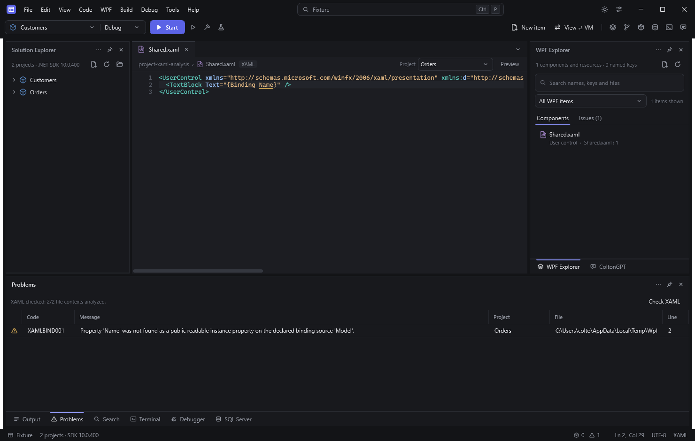

*The same linked view is evaluated for two projects. Problems identifies the Orders context where the declared source type lacks `Name`.*

Static analysis describes declared types. Runtime-created DataContexts, dynamic resources, application-specific markup extensions, and ambiguous sources can remain unresolved. See the [language-service design and coverage](xaml-devtools-design.md).

## Connect bindings to named elements

`Binding.ElementName` shares compiler-backed scope resolution with name completion, hover, F12 and checked spelling fixes. Both `x:Name` and supported runtime-name aliases such as WPF's `Name` participate, including forward declarations. Standard templates keep their local names separate.

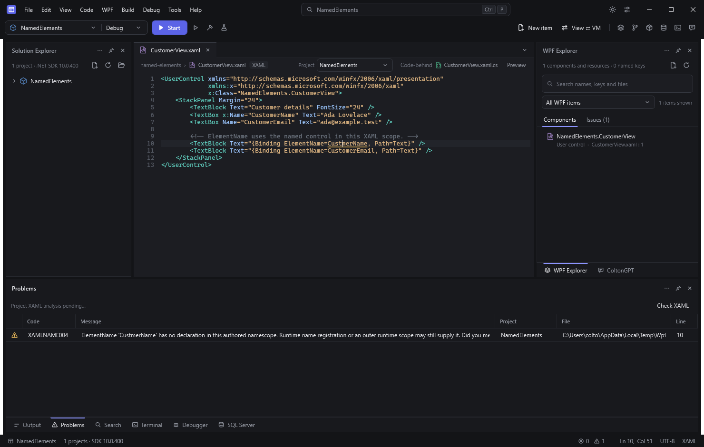

*The fixture declares `CustomerName`, but the binding uses `CustmerName`. Problems reports that the authored scope has no matching declaration.*

Missing authored names are warnings because runtime registration or outer scopes may supply them. Unknown custom scopes remain unresolved. **Ctrl+.** can offer an unambiguous spelling fix with workspace undo. See [named-element assistance and limits](xaml-named-elements.md).

## Keep C# current while editing XAML

Change a named control's type directly in XAML. On a supported evaluated WPF page, the worker updates its C# field type from the unsaved buffer. Completion offers the new type's members, and existing C# receives diagnostics when its member access no longer matches.

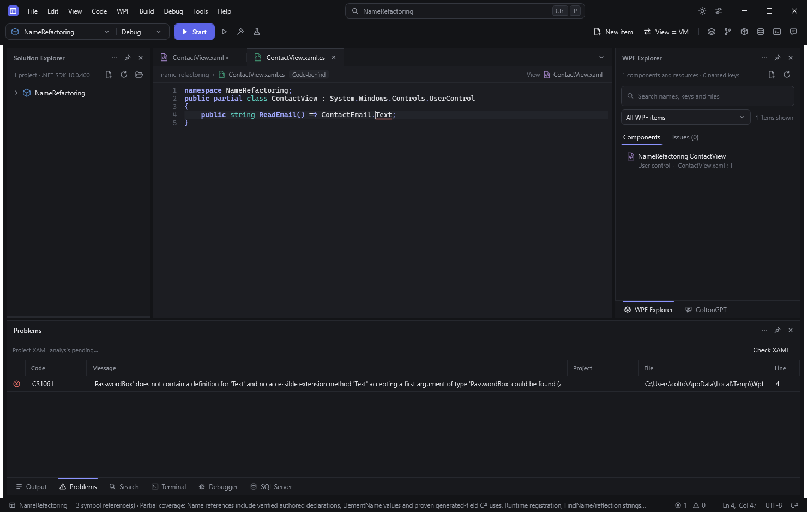

*The fixture changed `ContactEmail` from `TextBox` to `PasswordBox` in an unsaved XAML buffer. The unchanged C# still accesses `.Text`, so its compiler diagnostic now names `PasswordBox`. No generated file was rewritten for this field update.*

Adding, removing or renaming a supported named element also updates current fields, including on an evaluated page before its first build. **F12** from C# selects the current authored name. Use reviewed **Rename** to change existing references together; direct typing changes only the edited source. Malformed or unsupported declarations receive incomplete-coverage status. These declarations describe editor semantics; a build still compiles saved XAML. See [current fields and their limits](xaml-named-elements.md#current-xaml-fields-while-editing).

## Refactor a name across XAML and C#

Use **Find References** on a supported declaration, `ElementName` value or current page-field use. Search results connect the authored XAML and C# locations while retaining project context.

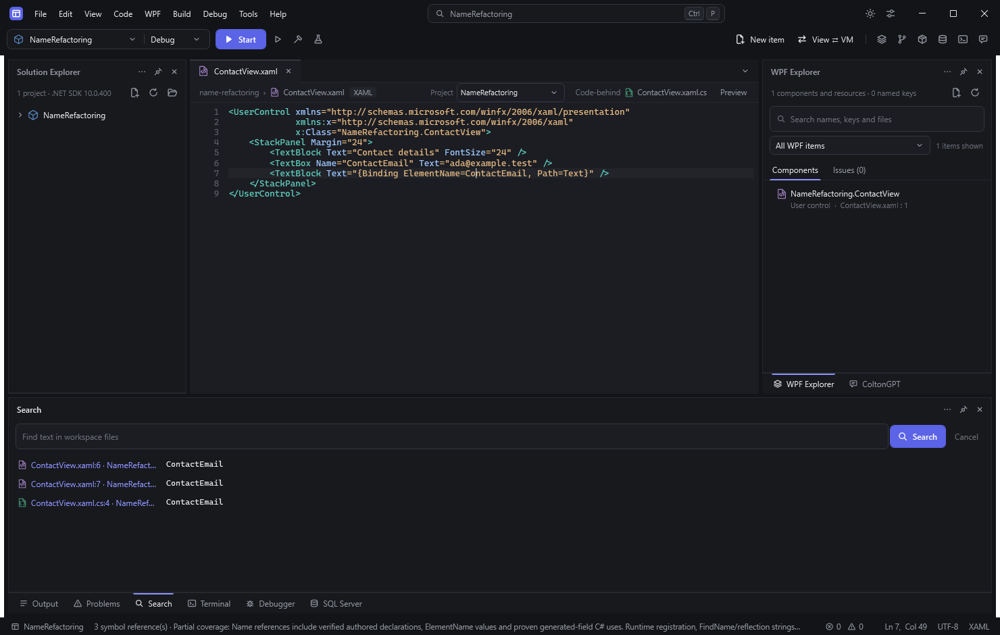

*The three rows belong to one name identity. Generated output files are excluded from the displayed locations.*

**Rename** opens a review of the authored changes. The selected XAML diff below changes both the runtime-name alias and its binding reference; the file list also includes the C# use.

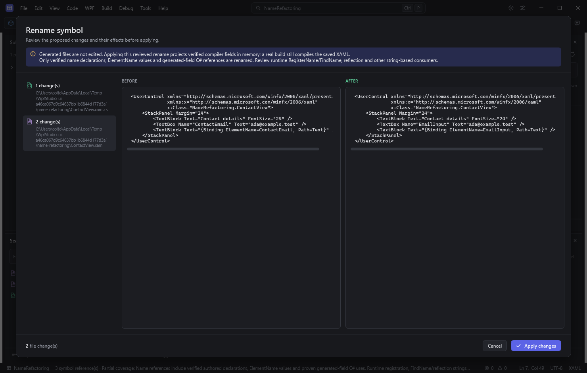

*Apply changes updates editor buffers as one undoable transaction without saving. The current workflow synchronizes page fields from those source buffers, keeping C# assistance and subsequent renames current. Generated files remain unchanged; a real build still compiles saved XAML.*

WpfStudio connects the exact current name span, page class and field type to an editor-derived C# declaration in each owning project. Undo, discard and language-worker restart derive fields again from current source. Template-local names retain their own scope identities, and broader name consumers still require support. See [current fields and refactoring coverage](xaml-named-elements.md#current-xaml-fields-while-editing).

## Preview a named application state

Open **XAML Designer**, select a configured **Scenario**, and choose **Refresh**. Source mode renders the current editor buffer; compiled mode loads a built view. Project-defined data or view factories run in the isolated preview host. The active scenario and build provenance distinguish the accepted preview from a newly selected option.

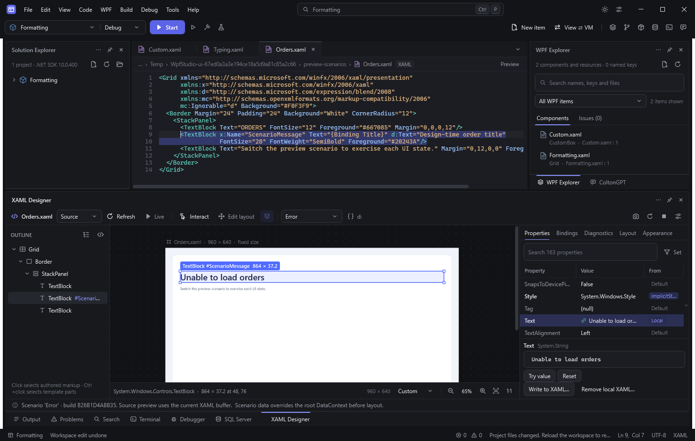

*This fixture's Error factory supplies “Unable to load orders.” The Properties tab shows the resulting Text value.*

Scenarios are explicitly configured in `wpfstudio.preview.json`; WpfStudio does not invent Loading, Empty, or Error data. Factories can execute application code and have external effects. **Update snapshot** observes the existing view; **Refresh** recreates it. See [preview scenarios](xaml-preview-scenarios.md).

## Work on the designer canvas

The designer arranges an **Outline**, the canvas and the inspector under one toolbar. The artboard takes its size from the root element (or its `d:DesignWidth`/`d:DesignHeight`) and is fitted to the canvas; the zoom bar, **Ctrl+wheel** and middle-button panning adjust the view. A click selects the authored element under the pointer and selects its start tag in the XAML editor. The outline folds template parts under their authored element.

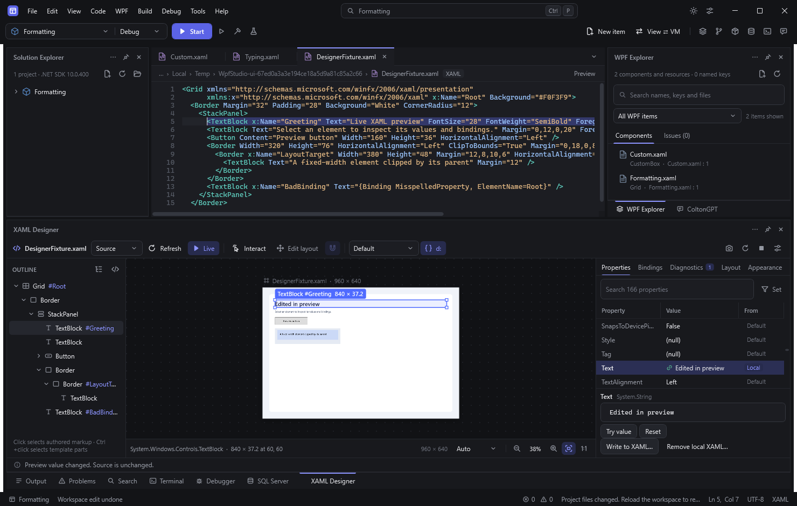

*The selected `Greeting` TextBlock carries its type, name and size on the canvas; the matching start tag is selected in the editor above.*

Live preview keeps the last successful frame on the canvas while newer XAML renders. When the edited markup cannot render, the error appears over that frame, and **Go to error** opens its line.

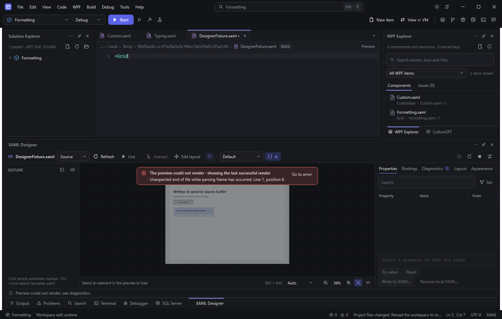

*The fixture's source was reduced to an unterminated `<Grid`. After the source is repaired, the next render selects the same `Greeting` element again.*

See [working on the canvas](xaml-preview-interaction.md#work-on-the-canvas) for zoom, selection and property search details.

## Follow a runtime binding back to XAML

Use **Run with inspection** or **Debug with inspection** for a supported .NET 8–10 WPF target. In **Live XAML**, select an element and open **Bindings**. The inspector reports observed source information and binding status. Select a root or composite child in **Binding declaration**, then choose **Show binding XAML**.

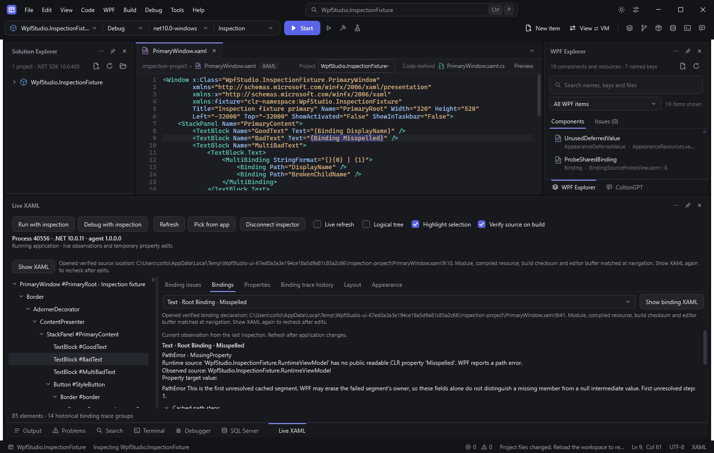

*The fixture has a real missing-member binding. Navigation selects its complete expression after checking the running binding, module, build source, and editor buffer.*

Source navigation requires matching evidence. Code-created bindings, tested template clones, and unverifiable source origins receive an explanation instead of a guessed location. Historical binding traces remain distinct from current observations. See [binding declaration navigation](xaml-binding-navigation.md) and [runtime inspection](xaml-runtime-bootstrap.md).

## Inspect the failed binding step

Preview and Live XAML share the same explanation panel. Select **Explain binding** on a preview diagnostic, or **Show element** on a live issue, to open the observed binding. The **Binding declaration** selector also exposes individual composite children. Scroll through cached path steps, current validation and separately labeled historical WPF evidence.

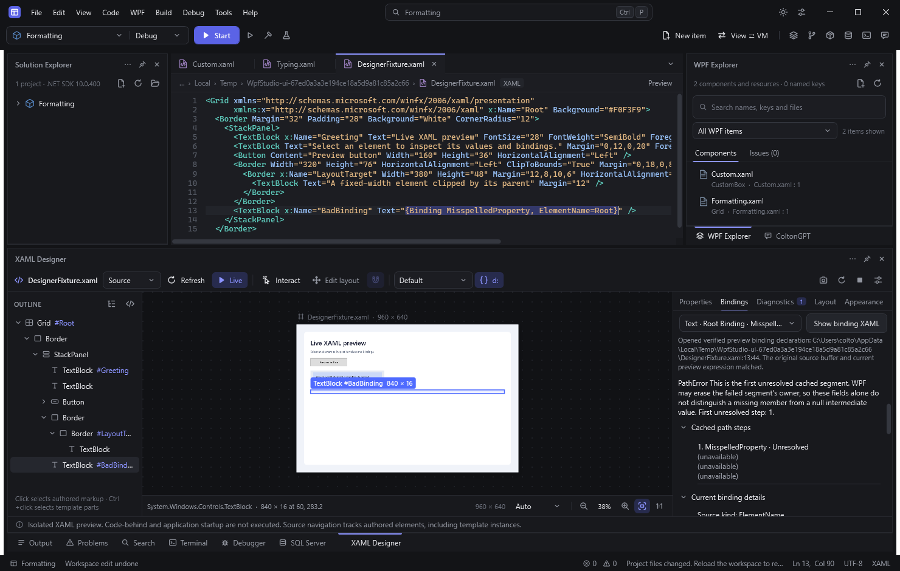

*This preview's `ElementName` binding cannot resolve `MisspelledProperty`. The cached step identifies where resolution stopped without evaluating model getters.*

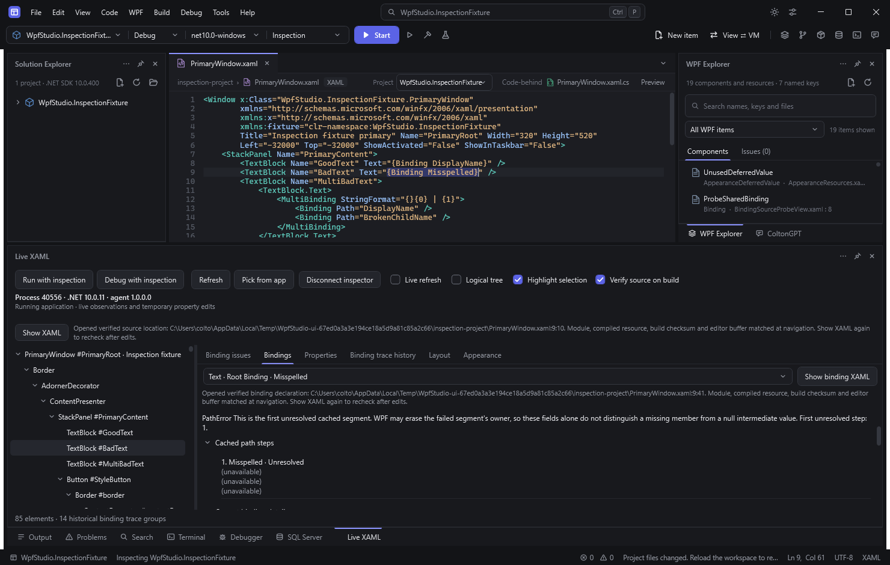

*The same panel inspects a live application. Current status and cached steps belong to the selected expression; earlier WPF notifications remain historical.*

WPF can discard a failed step's owner, so the cached fields cannot always distinguish a null intermediate from a missing member. Unsupported runtime shapes return an explanation. Refresh after application changes; these are observations from the last inspection. See [binding explanations and limits](xaml-binding-diagnostics.md).

## Explain a layout mismatch

Select an element and open **Layout** in either inspector. Desired size, render size, layout slot, margins, alignment, transforms, and clipping facts help explain what WPF arranged. Enable **Show layout overlay** to compare the observed geometry.

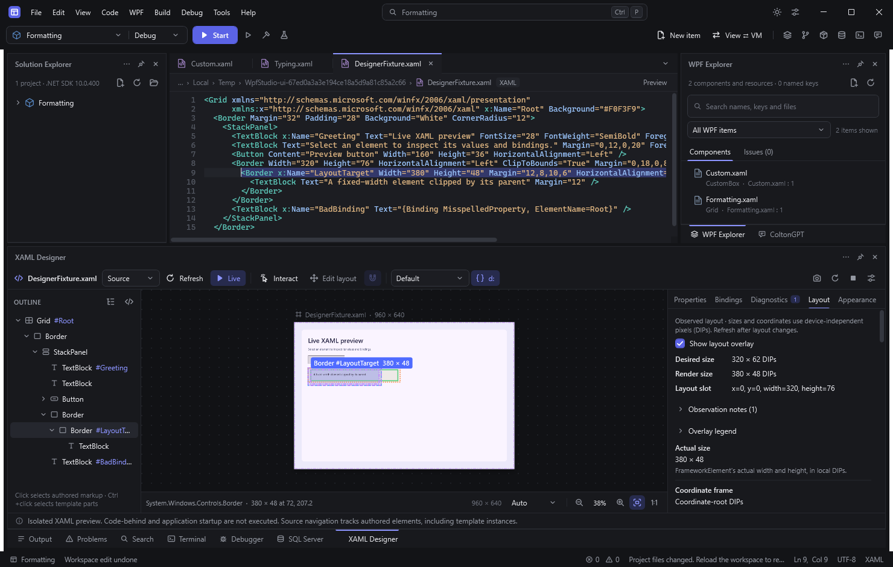

*The selected border renders wider than its parent-assigned slot. Cyan marks the slot, green the render box, orange a supported margin outline, and purple clip bounds.*

These are snapshots; refresh after layout changes. Clip outlines are bounding approximations, and unsupported geometry is reported. Live overlays need a suitable adorner surface.

## Move and resize with a source review

Enable **Edit layout** in the source preview. Select a direct Canvas or Grid child, then drag its frame or resize handles. A draft outline and snap guides show the proposed geometry. Arrow keys nudge, Shift increases the step, Ctrl+arrows resize, Enter reviews and Escape cancels.

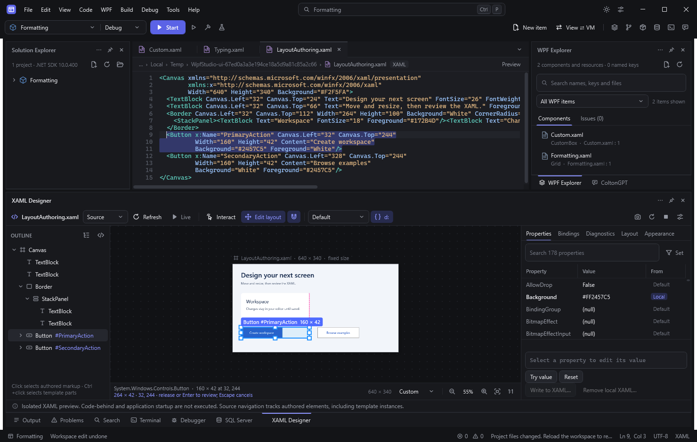

*The fixture previews a resize from 160 to 264 DIPs. The original button remains unchanged while the draft is visible.*

Release the pointer or press Enter to review the XAML. Applying updates the unsaved source buffer as one workspace edit, with one Undo restoring the whole gesture.

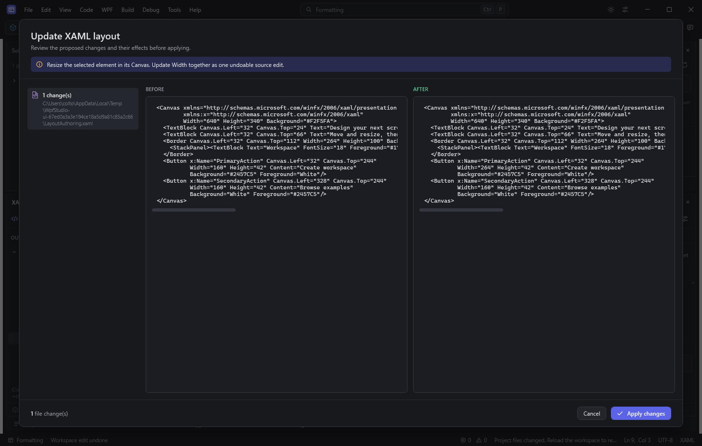

*Canvas anchors are retained. Grid gestures preserve the current row, column and spans; new dimensions are assigned only on resized axes. The host rechecks the observed layout before applying.*

This supports a verified subset of source layout. Templates, generated containers, transformed or right-to-left frames, layout expressions and compiled previews remain unavailable for gestures. See [layout editing and its limits](xaml-preview-interaction.md#move-and-resize-authored-elements).

## Inspect appearance without guessing the winning setter

Open **Appearance** and choose a dependency property. The panel shows its effective value and WPF base value source, relevant Style/BasedOn/trigger declarations, available resource keys, and supported resource observations. Refreshing appearance preserves the unapplied property draft.

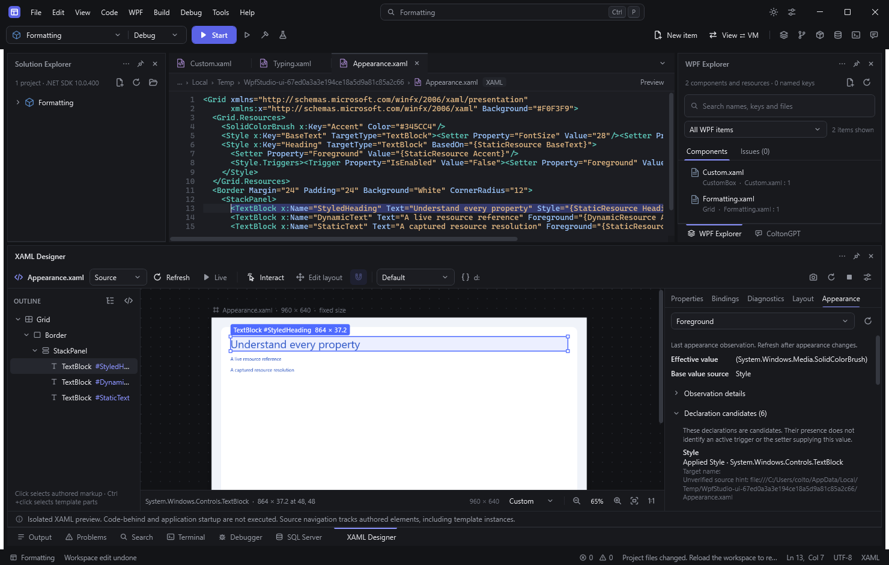

*WPF reports Style as the selected Foreground property's base value source. Declaration candidates are listed separately.*

A candidate declaration does not establish an active trigger or the setter currently supplying the value. Historical static-resource lookups do not prove the current resource origin. See [appearance inspection](xaml-appearance.md).

## Review an experiment before keeping it

Try supported property values temporarily in the inspector, then request a source edit when the authored location can be verified. The review explains the proposed local change and shows the before/after text. Applying changes updates the editor buffer with workspace undo; save normally when ready.

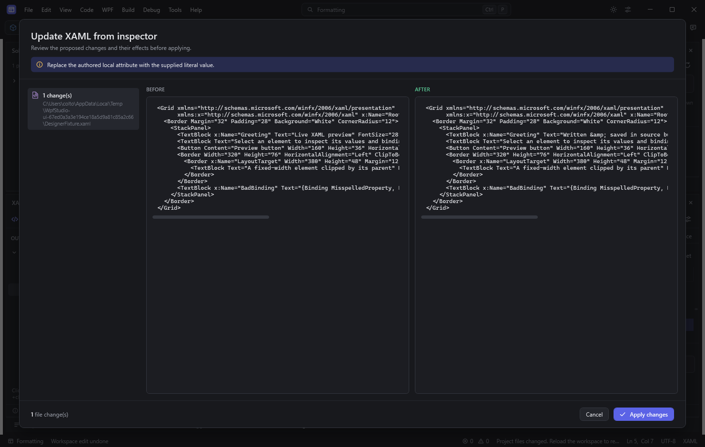

*This preview proposes replacing an authored Text attribute. The change remains a review until Apply changes is chosen.*

Temporary runtime edits and source edits are separate operations. A source change does not perform Hot Reload or update the running application automatically. Replacing a binding, resource expression, or shared template declaration requires the corresponding review and source checks.

## What these screenshots do not establish

Native **Interact** mode is implemented using the existing preview view in a separate process. Physical input fidelity, IME, popup behavior, mixed-monitor DPI, docking/floating, and accessibility still require acceptance testing; these inspector screenshots do not establish that coverage. See [native preview interaction and its limits](xaml-preview-interaction.md).

These captures do not establish feature parity with Visual Studio or a measured performance advantage over it.

Visual drag-and-drop authoring, complete runtime resource attribution, arbitrary application startup fidelity, and inspection of already-running uninstrumented applications are not completed capabilities. The [full-goal acceptance ledger](xaml-devtools-design.md#full-goal-acceptance-ledger) tracks the remaining work.

## Capture provenance

| Documentation image | Original automated capture |
| --- | --- |
| `project-diagnostics.png` | `artifacts/screenshots/xaml-project-diagnostics.png` |
| `named-elements.png` | `artifacts/screenshots/xaml-named-elements.png` |
| `live-fields.png` | `artifacts/screenshots/xaml-live-fields.png` |
| `name-references.png` | `artifacts/screenshots/xaml-name-references.png` |
| `name-rename-review.png` | `artifacts/screenshots/xaml-name-rename-review.png` |
| `preview-scenarios.png` | `artifacts/screenshots/xaml-preview-scenarios.png` |
| `live-binding-source.png` | `artifacts/screenshots/live-xaml-binding-source.png` |
| `preview-binding-steps.png` | `artifacts/screenshots/xaml-preview-binding-details.png` |
| `live-binding-steps.png` | `artifacts/screenshots/live-xaml-binding-details.png` |
| `layout-observation.png` | `artifacts/screenshots/xaml-designer-layout-details.png` |
| `appearance-observation.png` | `artifacts/screenshots/xaml-preview-appearance.png` |
| `source-edit-review.png` | `artifacts/screenshots/xaml-designer-source-diff.png` |
| `layout-editing.png` | `artifacts/screenshots/xaml-layout-editing.png` |
| `layout-editing-review.png` | `artifacts/screenshots/xaml-layout-editing-review.png` |
| `designer-canvas.png` | `artifacts/screenshots/xaml-designer.png` |
| `designer-render-error.png` | `artifacts/screenshots/xaml-designer-render-error.png` |

The copies under `docs/images/xaml/` remain available on GitHub independently of the ignored `artifacts/` directory.
